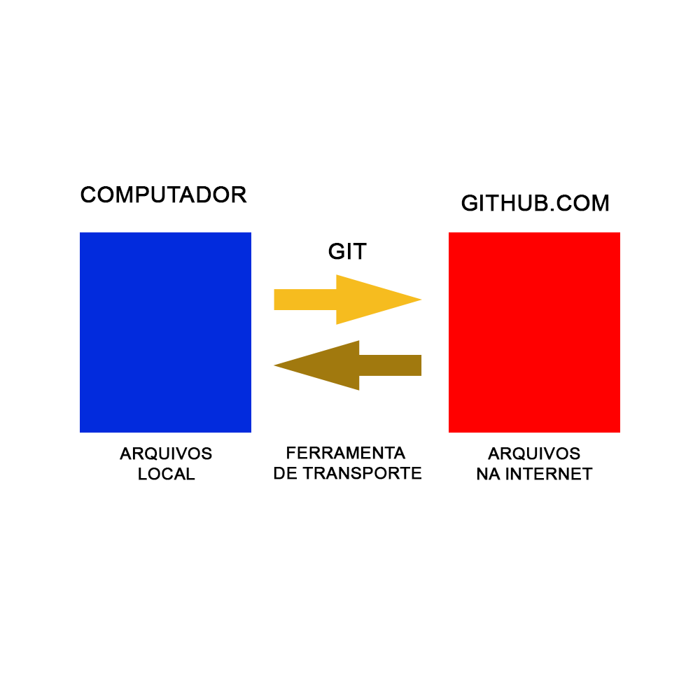
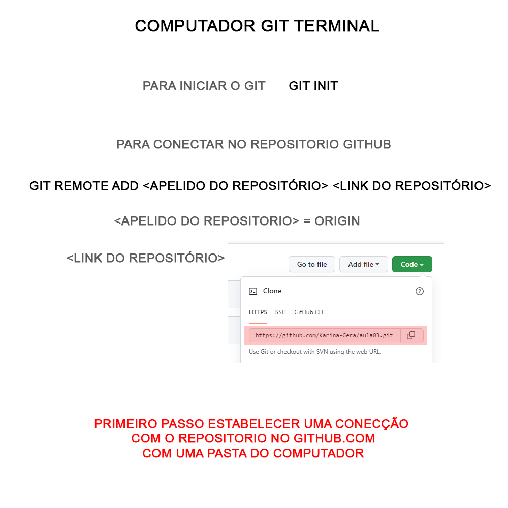
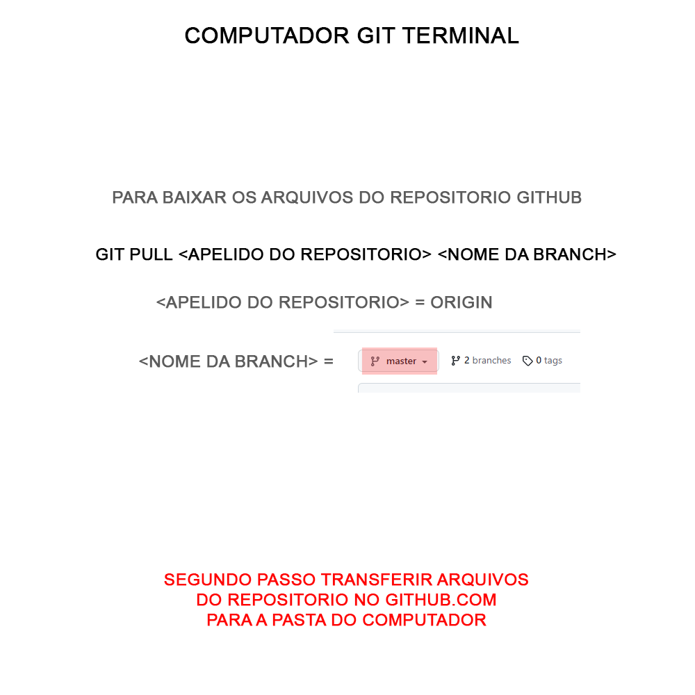
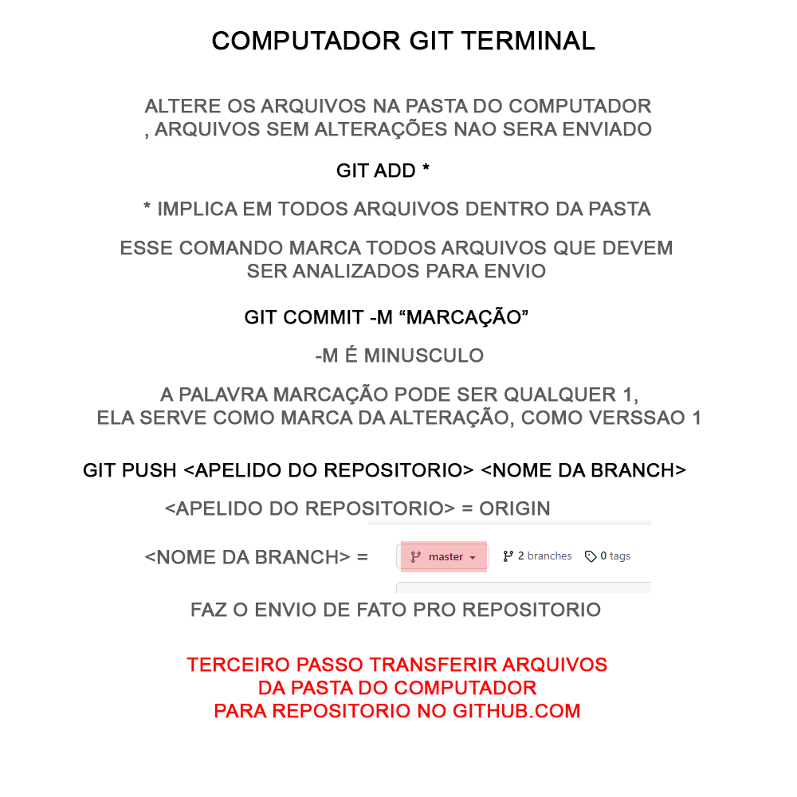
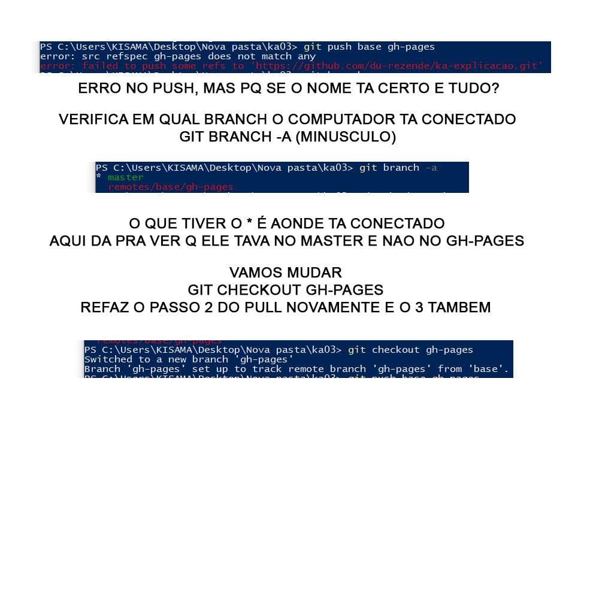

## Logica do GIT

### PASSO 1

### PASSO 2

### PASSO 3

### PASSO 4



### ERROS



Olha o link pra endereço
[ABRE OP FACE](https://www.facebook.com/)

Pode ate manda email
[ENVIAR EMAIL](mailto:du.rezende@gmail.com)

```caixa cinzinha
```
